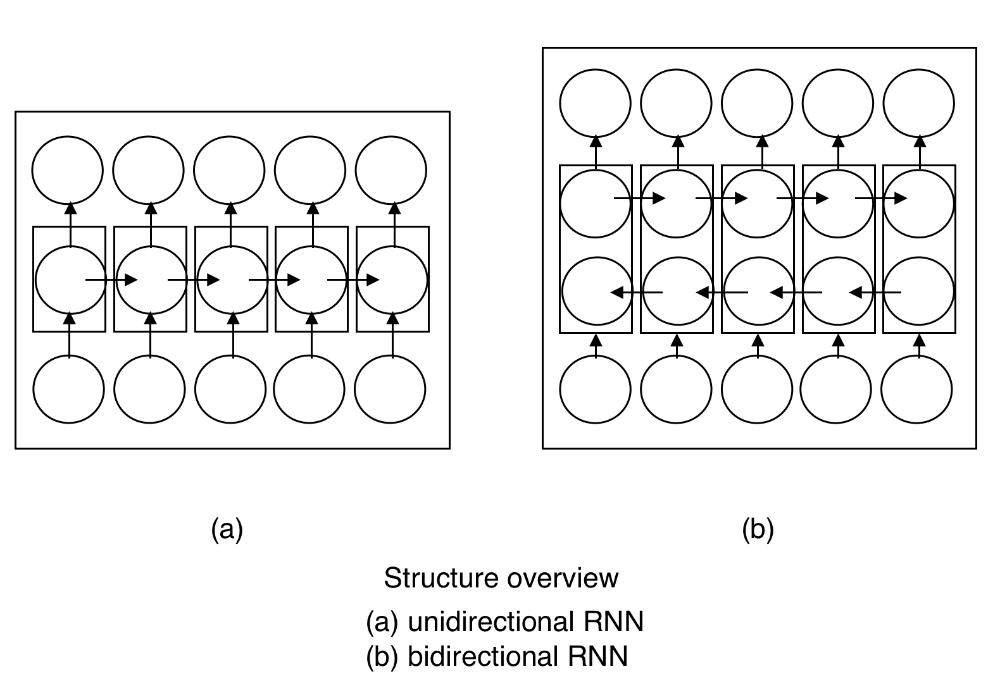
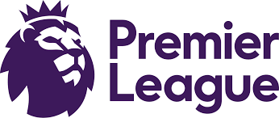
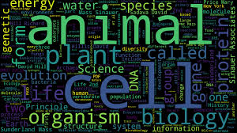
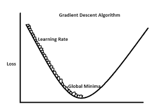
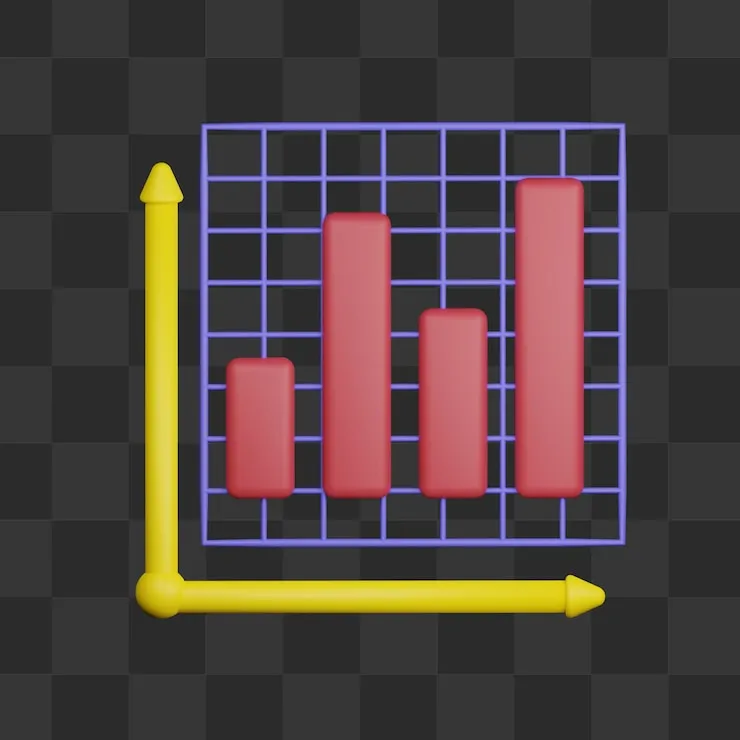

# Hi, I'm Pranav Srinivas Venkatesh👋

Welcome to my personal portfolio — a collection of all the **Data Science** and **AI and ML** projects I’ve completed for academic, self-study, and personal growth.

This portfolio also showcases my **achievements**, **technical skills**, and **certifications** in the data domain.  
It is **updated regularly** as I continue learning and building impactful projects.

Feel free to explore, connect, or collaborate!
## 📫 Contact

- [Email](mailto:pranav.sv.data@gmail.com) [LinkedIn](https://www.linkedin.com/in/pranav-srinivas-venkatesh-81a211163/)

## 👨‍💻 Projects

### 📊 Data Science / Machine Learning
- [Telecom Churn Prediction](#telecom-churn-prediction)
- [Crop Management System](#crop-management-system-using-ml)
- [Gold Price Prediction](#gold-price-prediction)
- [Loan Classifier](#loan-classifier)
- [Clustering](#clustering)
- [Netflix Dashboard](#netflix-dashboard-using-powerbi)
- [Milk Quality Prediction](#milk-quality-prediction---mlops-project)

### 🗣️ NLP / Generative AI
- [Blogs Recommender System](#blogs-recommender-system)
- [MedBuddy Chatbot](#med-buddy-chatbot)
- [Unreasonable Effectiveness of RNN](#unreasonable-effectiveness-of-rnn)
- [EPL Data Analysis Chatbot](#epl-data-analysis-and-prediction)
- [Recipe Finder](#recipe-finder-with-ingredient-search)
- [News Aggregator](#news-aggregator)

### 👁️ Computer Vision / AI Applications
- [Dog vs Cat Classification](#dog-vs-cat-classsification-using-mobilenet)
- [Breast Cancer Classification](#breast-cancer-classification-using-neural-networks)
- [Market Basket Analysis](#market-basket-analysis)

## 📊 Data Science / Machine Learning Projects  

<table>
  <tr>
    <td width="25%">
      
    </td>
    <td>
      
      <a href="https://github.com/pranavsrinivas29/Telecom-Churn-Prediction"><b>Telecom-Churn-Prediction</b></a> 
      This project focuses on predicting customer churn based on their telecom service usage and profile attributes...
    </td>
  </tr>

  <tr>
    <td width="25%">
      
    </td>
    <td>
      
      <a href="https://github.com/pranavsrinivas29/CropManagementSystem-Using-ML"><b>Crop Management System Using ML</b></a> 
      This project includes three models: a fertilizer predictor, a crop predictor, and a crop price forecaster...
    </td>
  </tr>

  <tr>
    <td width="25%">
      
    </td>
    <td>
      
      <a href="https://github.com/pranavsrinivas29/Gold-Price-Prediction"><b>Gold Price Prediction</b></a> 
      This project forecasts gold prices using XGBoost based on evaluation from LazyRegressor...
    </td>
  </tr>

  <tr>
    <td width="25%">
      
    </td>
    <td>
      
      <a href="https://github.com/pranavsrinivas29/Clustering-Methods"><b>Clustering</b></a> 
      Customer Segmentation Analysis using partitioning and hierarchical clustering methods...
    </td>
  </tr>

  <tr>
    <td width="25%">
      
    </td>
    <td>
      
      <a href="https://github.com/pranavsrinivas29/Netflix-Dashboard-using-PowerBI"><b>Netflix Dashboard</b></a> 
      An interactive Power BI dashboard that provides an insightful analysis of Netflix data...
    </td>
  </tr>

  <tr>
    <td width="25%">
      
    </td>
    <td>
      
      <a href="https://github.com/pranavsrinivas29/Loan-Classification"><b>Loan Classifier</b></a> 
      A modular ML application to predict loan approval using Logistic Regression with FastAPI + Streamlit...
    </td>
  </tr>

  <tr>
    <td width="25%">
      
    </td>
    <td>
      
      <a href="https://github.com/pranavsrinivas29/Milk-Quality-Prediction"><b>Milk Quality Prediction - MLOps Project</b></a> 
      Classifies milk quality (Low, Medium, High) using pH, Temperature, Taste, Odor, Fat, Turbidity, and Color...
    </td>
  </tr>
</table>

---

## 🗣️ NLP / Generative AI Projects  

<table>
  <tr>
    <td width="25%">
      
    </td>
    <td>
      
      <a href="https://github.com/pranavsrinivas29/Blogs-Recommender-System"><b>Blogs-Recommender-System</b></a> 
      A multi-level hybrid recommender system using popularity-based, content-based, and collaborative filtering...
    </td>
  </tr>

  <tr>
    <td width="25%">
      
    </td>
    <td>
      
      <a href="https://github.com/pranavsrinivas29/MedBuddy_chatbot"><b>Med-Buddy Chatbot</b></a> 
      A LangChain + LLM chatbot for drug information, comparisons, and symptom-based recommendations...
    </td>
  </tr>

  <tr>
    <td width="25%">
      
    </td>
    <td>
      
      <a href="https://github.com/pranavsrinivas29/MedBuddy_chatbot"><b>Unreasonable-effectiveness-of-RNN</b></a> 
      Exploring RNNs for text generation: Shakespeare dialogues, baby names, and LaTeX code generation...
    </td>
  </tr>

  <tr>
    <td width="25%">
      
    </td>
    <td>
      
      <a href="https://github.com/pranavsrinivas29/EPL-Data-Analysis-and-Prediction"><b>EPL Data Analysis Chatbot</b></a> 
      A chatbot that answers Premier League questions using FAISS + Sentence Transformers + GPT-2...
    </td>
  </tr>

  <tr>
    <td width="25%">
      
    </td>
    <td>
      
      <a href="https://github.com/pranavsrinivas29/Reciepe-Finder"><b>Recipe Finder</b></a> 
      Ingredient-based recipe search using HuggingFace embeddings + ChromaDB + Streamlit...
    </td>
  </tr>

  <tr>
    <td width="25%">
      
    </td>
    <td>
      
      <a href="https://github.com/pranavsrinivas29/Personalized-News-Aggregator"><b>News Aggregator</b></a> 
      AI-powered RAG-based news aggregator that fetches, filters, and summarizes real-time articles...
    </td>
  </tr>
</table>

---

## 👁️ Computer Vision / AI Application Projects  

<table>
  <tr>
    <td width="25%">
      
    </td>
    <td>
      
      <a href="https://github.com/pranavsrinivas29/Dog-vs-Cat-Classsification-using-MobileNet"><b>Dog vs Cat Classification</b></a> 
      Image classification pipeline using TensorFlow + MobileNetV2 for binary classification...
    </td>
  </tr>

  <tr>
    <td width="25%">
      
    </td>
    <td>
      
      <a href="https://github.com/pranavsrinivas29/Breast-Cancer-Classification"><b>Breast Cancer Classification</b></a> 
      Neural network-based classification of breast cancer using structured medical datasets...
    </td>
  </tr>

  <tr>
    <td width="25%">
      
    </td>
    <td>
      
      <a href="https://github.com/pranavsrinivas29/Market-Basket-Analysis"><b>Market Basket Analysis</b></a> 
      Market basket analysis using Apriori, Eclat, and Graph Neural Networks (GNN)...
    </td>
  </tr>
</table>

## Case Studies
<table>
  <tr>
    <td width="25%">
      
    </td>
    <td>
      <a href="https://github.com/pranavsrinivas29/Blogs-Recommender-System"><b>Gradient Descent methods analysis</b></a> 
      This project demonstrates the effect of various gradient descent (GD) optimization algorithms on training a Multilayer Perceptron (MLP) model for a regression task using the California Housing dataset. The core objective is to analyze and compare optimizers such as Adam, SGD, RMSprop, Adagrad, Rprop, and SGD with momentum.
    </td>
  </tr>
</table>

<table>
  <tr>
    <td width="25%">
      
    </td>
    <td>
      <a href="https://github.com/pranavsrinivas29/Statistical-test-analysis"><b>Statistical Methods Analysis</b></a> 
      An interactive Dash-based web application for performing statistical hypothesis tests on COVID-19 data grouped by WHO region. Users can explore Chi-Square Tests, T-Tests, and Z-Tests on metrics like case fatality and recovery rates.
    </td>
  </tr>
</table>

## Certificates
<table>
  <tr>
    <td>
      <a href="certificates/Transcript - PranavSrinivasVenkatesh-2979 _ Microsoft Learn.pdf" target="_blank">
        <b>Microsoft Certified: Azure AI Fundamentals (AI 900)</b>
      </a>
    </td>
    <td>
      <a href="certificates/databricks_fundamentals.png" target="_blank">
        <b>Databricks Fundamentals</b>
      </a>
    </td>
  </tr>
  <tr>
    <td>
      <a href="https://www.cloudskillsboost.google/public_profiles/9eb5bf7d-87ac-42a1-837d-ef861532e310/badges/10201884" target="_blank">
        <b>Introduction to Generative AI</b>
      </a>
    </td>
    <td>
      <a href="https://www.cloudskillsboost.google/public_profiles/9eb5bf7d-87ac-42a1-837d-ef861532e310/badges/10249537" target="_blank">
        <b>Prompt Design in Vertex AI</b>
      </a>
    </td>
  </tr>
  <tr>
    <td>
      <a href="https://www.hackerrank.com/certificates/b56051017038" target="_blank">
        <b>Python Basic</b>
      </a>
    </td>
    <!-- <td>
      <a href="https://www.cloudskillsboost.google/public_profiles/9eb5bf7d-87ac-42a1-837d-ef861532e310/badges/10249537" target="_blank">
        <b>Prompt Design in Vertex AI</b>
      </a>
    </td> -->
  </tr>

</table>

## Tools and Frameworks

  
  
  
  
  
  
  
  
  
  
  
  
  
  
  
  
  
  
  
  
  
  

## Publication
<a href="https://www.ijisrt.com/crop-management-system-using-machine-learning"><b>Crop Management System Using ML<b><a> 