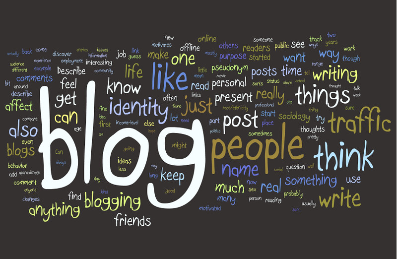

# Hi, I'm Pranav Srinivas Venkatesh👋

Welcome to my personal portfolio — a collection of all the **Data Science** and **Data Analysis** projects I’ve completed for academic, self-study, and personal growth.

This portfolio also showcases my **achievements**, **technical skills**, and **certifications** in the data domain.  
It is **updated regularly** as I continue learning and building impactful projects.

Feel free to explore, connect, or collaborate!
## 📫 Contact

- [Email](mailto:pranav.sv.data@gmail.com) [LinkedIn](https://www.linkedin.com/in/pranav-srinivas-venkatesh-81a211163/)

## 👨‍💻 Projects

<table>
  <tr>
    <td width="25%">
      
    </td>
    <td>
      <a href="https://github.com/pranavsrinivas29/Blogs-Recommender-System"><b>Blogs-Recommender-System</b></a> 
      This project builds a multi-level hybrid blog recommendation system using a combination of popularity-based, content-based, collaborative filtering approaches. It is based on three main datasets: author information, blog metadata, and user-blog interaction (ratings).
    </td>
  </tr>

  <tr>
    <td width="25%">
      
    </td>
    <td>
      <a href="https://github.com/pranavsrinivas29/MedBuddy_chatbot"><b>Med-Buddy Chatbot</b></a> 
      MedBuddy is a conversational medical assistant built with LangChain, Streamlit, and LLMs (Zephyr/Ollama). It helps users interactively explore drug-related information, compare medications, understand medical terms, and even suggest drugs based on symptoms.
    </td>
  </tr>

  <tr>
    <td width="25%">
      
    </td>
    <td>
      <a href="https://github.com/pranavsrinivas29/MedBuddy_chatbot"><b>Unreasonable-effectiveness-of-RNN</b></a> 
      In this project, I explored three use cases where RNNs act as character-level language models.
      First, the RNN is trained on Shakespeare’s dialogues to generate English-like text. Then, it's used to create new baby names based on a dataset of existing ones. Finally, it generates LaTeX code from a set of sample inputs.
    </td>
  </tr>

  <tr>
    <td width="25%">
      
    </td>
    <td>
      <a href="https://github.com/pranavsrinivas29/Telecom-Churn-Prediction"><b>Telecom-Churn-Prediction</b></a> 
      This project focuses on predicting customer churn based on their telecom service usage and profile attributes. The goal is to explore feature importance, address class imbalance via algorithm-level methods (not resampling), and compare classifier performance.
    </td>
  </tr>

</table>

## Certificates

## Publication
<a href="https://github.com/pranavsrinivas29/Telecom-Churn-Prediction"><b>Crop Management System Using ML</b><a> 

